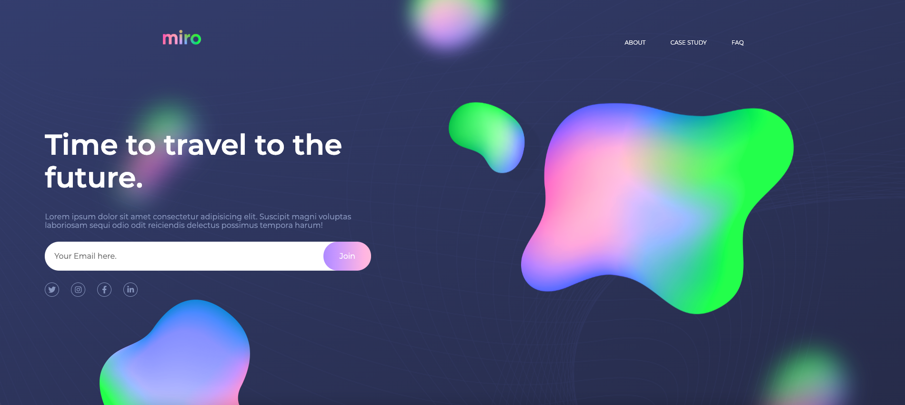

## Link. 🔗

[](https://app.netlify.com/sites/miroapp/deploys)

https://miroapp.netlify.app/

# Miro Landing Page. 🚀

This is a simple Responsive Landing Page, with some efects. Using CSS Animation.

- To get started:

## Clone the repository

```bash
git clone https://github.com/RenszCamacho/Miro-Landing-Page.git
cd Miro-Landing-Page
```

## Install the dependencies

```bash
#Using npm
npm install

#Using yarn
yarn
```

## Run it live

```bash
#Build dev
npm run dev or yarn dev

#Build for Production
npm run build or yarn build
```

This is deployed on Netlify.

## Tools. ⚒️

- HTML5.
- CSS3.
- ParcelJs(Bundler).
- Sass(Css Pre-precesor).
- Methodology/BEM(Css Especificity).
- Git and Github.
